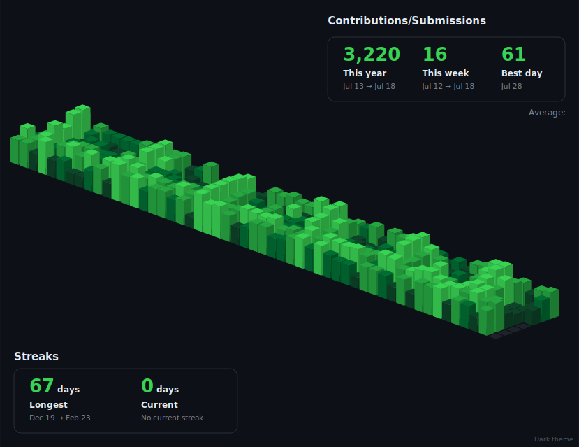
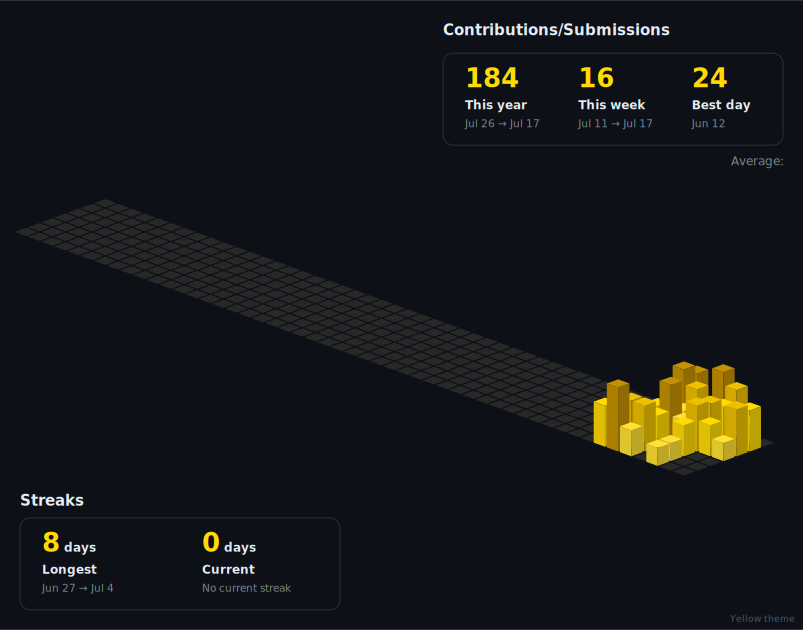
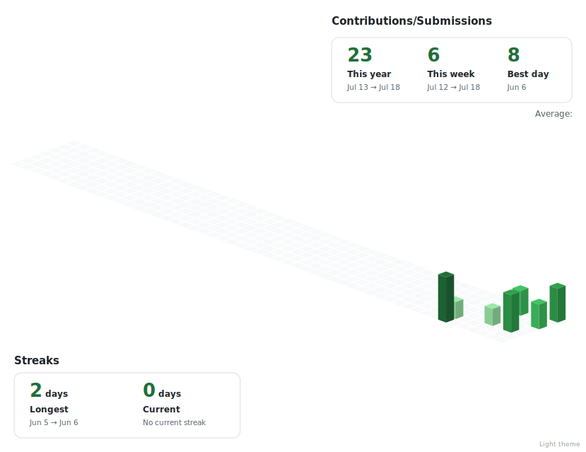
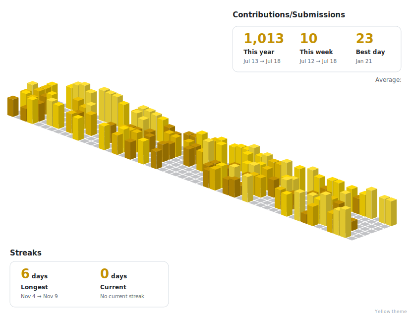
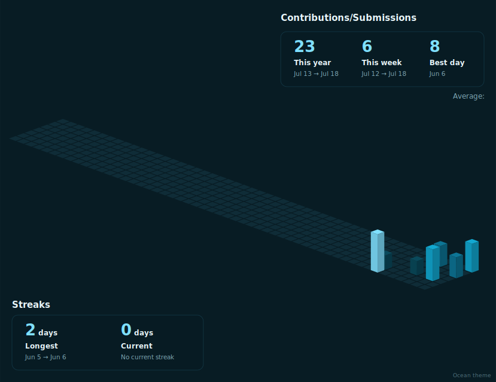

# Isometric 3D Contribution Graph Generator

Generate beautiful **isometric 3D SVG contribution graphs** for your GitHub profile, LeetCode submissions, or any future contribution-based platform.

## Sample images







## Setup

- Clone repo
- If desired generate venv
- Install requirements.txt `pip install -r requirments.txt`
- Change variable values in `main.py`
- Run `main.py` via terminal, and you'll get output in `.\output`
- Once you have tested the Code for yourself, you can integrate it in your github profile README like me (or any other way you wish to use it)

## Description

- The main Design focus of the whole project is **extensibilty** in the form of provision for addition of newer parsers and themes
- This is achieved simply by adding the code to initialise the parser in the `main.py` and writing parsers for particular platforms
- Custom themes can also be set in the `svg_generator.py` by following the format of the pre-existing `PALETTES` definer as the code renders SVG for each and every theme


## Features

* No GitHub/Leetcode Personal Access API Tokens needed. (Just add usernames, the parsers fetch the data from publically available view of profiles)
  * though you can add any type of parser you wish to, just that it gives out data in the specified format
* Multiple color themes ! (automatically renders every registered theme, so you can add your custom themes too !)
* Transparent background option using boolean variable in `main.py`
* Uses a common CSV format, so you can extend the code to render heatmaps for your own personal parsers too.
* Generates clean, scalable SVGs


## Project Structure

```text
.
├─ parsers/
│  ├─ github_parser.py
│  └─ leetcode_parser.py
├─ svg_generator.py
├─ main.py
├─ requirements.txt
├─ run.bat
│
│
├─ data/                                     # generated by code (you can change)
│  ├─ github_contributions.csv
│  └─ leetcode_submissions.csv
└─ output/                                   # generated by code (you can change)
   ├─ github-dark.svg
   ├─ github-light.svg
   ├─ ...
```

## Configuration

Open `main.py` and set these variables as per your liking.

```python
GITHUB_USERNAME = "your-github-username"
LEETCODE_USERNAME = "your-leetcode-username"
DATA_DIR = Path("data")
OUTPUT_DIR = Path("output")
TRANSPARENT_BACKGROUND = True
```

## Usage

Simply run

```bash
python main.py
```

The script will:

1. Fetch Data using parsers and store to csv files
2. Draw SVGs in all the themes

---

Built-in Themes currently included: `dark, light, yellow_light, yellow_dark, Ocean`

Adding a new theme only requires adding another entry to the `PALETTES` dictionary inside `svg_generator.py`.

No other code needs to be modified.

## Adding New Data Sources

Every platform follows the same pipeline:

```text
main.py (inputs required token or username and runs the parsers)
    ↓
Parser
    ↓
CSV (date, count)
    ↓
SVG Renderer (has themes)
    ↓
SVG files in output directory
```

To support another platform:

1. Create a parser inside `parsers/`

Example:

```python
def fetch_myplatform(username):
    return [
        ("2026-01-01", 3),
        ("2026-01-02", 7),
    ]
```

2. Register it inside `DATA_SOURCES` in `main.py`.

That's it.

CSV generation and SVG rendering happen automatically as the code renders svg for available valid CSV files in `/data`

## Output

Each generated SVG includes:

* Isometric 3D contribution bars
* Total contribution statistics
* Contribution\Submissions legend
* Month labels
* Current theme name

## Data Sources

### - GitHub Parser

The parser fetches data directly from GitHub's public contribution calendar page. No authentication is required.

### - LeetCode Parser

Uses LeetCode's public GraphQL endpoint to retrieve the submission calendar. No authentication is required for public profiles.

## Script (`run.bat`)

I recommend setting up a script to run this code and push the SVGs to github like I have made for windows in this repo using a .bat file. Using this you can upload updated SVGs easily with one click whenever you feel like it without setting up any server like other similar implementations.

```
Start
 │
Activate virtual environment
 │
Run Python program
 │
Deactivate virtual environment
 │
Stage all changes
 │
Are there staged changes?
 └────┐
      ├─────────────┐
     Yes            No
      |             │
Commit changes      │
      │        "No changes to commit"
Push to GitHub      │
      ├─────────────┘
  ┌───┘
 Pause
```

---

## Extra Info


